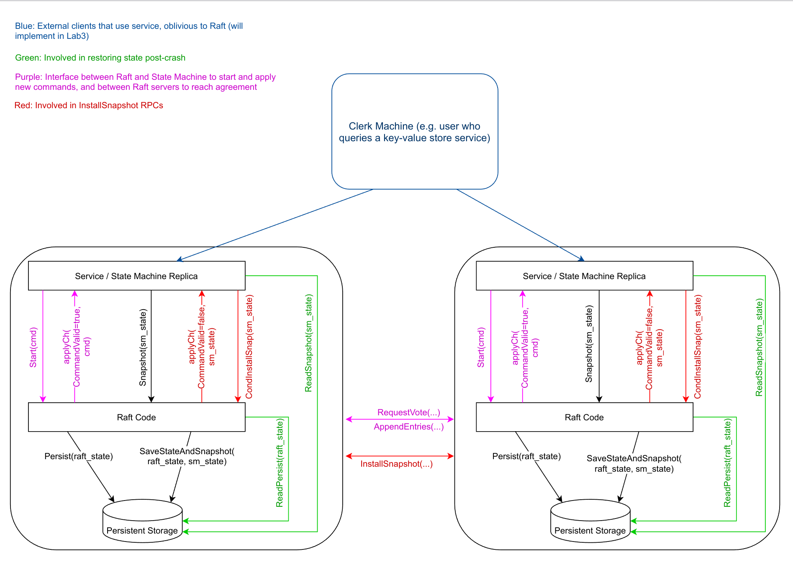

# Lab3 Raft

## 概述

6.5840（原6.824，之后统称6.5840）将Raft分为了4个part，分别是领导者选举(leader election)、日志(log)、持久化(persistence)、以及日志压缩(log compaction)，每一部分有各自的测试。能够理解，毕竟是要作为课程考核内容为学生进行打分的，能通过多少算多少。我们这些学习者在一开始上手去完成时，难免也会容易形成思维上的一个固化——一个part一个part去完成就好。但事实上，这种想法会使得完成的过程非常艰辛，尤其是part4快照的加入，很可能会让对Raft没有整体、宏观理解的学习者将他所完成的前三个part的代码全部重写。

在我开始学习6.5840之前，已经有了很多很好的教程，尤其是一位来自清华的学长的[文档](https://github.com/OneSizeFitsQuorum/MIT6.824-2021/blob/master/docs/lab2.md)，我在完成lab3时也很大程度借鉴了他的实现。但是，我还是感受到了很多的困难，有一些是算法整体流程的更宏观的问题，有一些则是在代码实现方面的更corner的问题。这也是我所编写这个文档的目的——并非是像已有的文档那样按照每个part去讲述如何实现，我更多的是能够给同为Raft的学习者们在算法宏观流程以及实现的corner这两方面提供一些帮助。本人才疏学浅，理解仅代表个人，如果有不足之处，还请包容。

## 宏观流程

在开始完成lab3前，一定要明白Raft究竟是做什么的、是如何运作的。首先Raft算法是一个共识(consensus)算法，共识算法的本质是解决分布式系统中多个节点之间对某个值达成一致意见的问题。再利用复制状态机(RSM)这一模型来保证分布式系统中多个节点间副本状态的一致。这里的副本，其实也就是paper中的状态机。而在lab4中，我们要实现一个基于Raft的KV分布式数据库，状态机自然也就相应变成了KV Servers中的data。要提到的是，它的运作流程其实6.5840有在lab4的部分给出，虽然连lab3都还没完成，但其实借助lab4中的应用例子，我认为反而能容易理解并完成lab3。lab4中的示意图如下所示：


client的请求首先打到一个KV Server上，Command可能是Get，也可能是Put。这里为了更好地说明，先以一个Put请求为例。首先，KV Server收到请求后，并不能直接去操纵自己的data，因为KV Server并不只自己这一台，需要保证client之后的请求打到其他KV Server时能够保证某种一致性【众所周知，Raft是能提供强一致性的共识算法。所谓强一致性，也被称为线性一致性、原子一致性。这种一致性模型是最强、最严格的，它意味着分布式系统中并发操作的结果与在单机上串行执行的结果是一样的，即需要所有操作能够获得一个全序关系】。因此，KV Server会将此次请求对应的Command传递给自己所对应的Raft节点，即通过lab3中的raft的`Start`方法。当然，Raft算法的设计中，Command的处理应当由Raft中的leader节点作为入口。因此，在lab4中，当该KV Server所对应的Raft节点发现自己不是leader时，会通过`Start`方法的返回值告知KV Server，KV Server自然也会通过RPC的响应告知client。client则会切换KV Server重试。当Raft leader通过Start方法接收到了Command时，便会开始进行对这一个Command达成共识的过程。当超过半数的节点对这一个Commit达成一致时，raft就可以提交该commit（当然，这里只是一个大致的描述，实际需要有延迟提交的处理，否则存在日志安全性问题，具体见paper中的figure-8。生产环境的Raft中还需要实现no-op日志，否则会有liveness的问题），并通知状态机应用。在lab3中，这一步骤是通过`applyCh`这个channel实现的。这样，达成共识了的大部分节点对应的KV Servers也就可以应用Command到它们的data。最后，最初接收到client请求的KV Server则会返回相应的响应。

至此，Raft的大致工作流程已经理清了。接下来，将开始讨论一些实现上的细节问题。这里不会对Raft算法的基本要素再进行说明，默认假设读者至少仔细阅读过原论文。尤其是figure-2！当然也不会放出完整代码，因为这是MIT现在还在使用的课程lab。我只会对一些比较难以理解、容易出现错误的部分进行讨论：

## 实现细节

首先给出我的Raft结构体：
```go
// Raft A Go object implementing a single Raft peer.
type Raft struct {
	mu        sync.RWMutex        // Lock to protect shared access to this peer's state
	peers     []*labrpc.ClientEnd // RPC end points of all peers
	persister *Persister          // Object to hold this peer's persisted state
	me        int                 // this peer's index into peers[]
	dead      int32               // set by Kill()
	
	// term 本质是一种逻辑时钟
	currentTerm int
	votedFor    int
	state       state

	heartbeatTimer *time.Timer
	electionTimer  *time.Timer

	log []Log
	// 参考清华大佬提到的
	// 蚂蚁金服自研的 SOFAJRaft 中的 replicator
	replicatorCond []*sync.Cond

	nextIndex  []int
	matchIndex []int

	applyCh   chan ApplyMsg
	applyCond *sync.Cond

	commitIndex int
	lastApplied int

	// 快照
	snapshot []byte
	// 快照中的最高索引
	lastIncludedIndex int
	// 快照中的最高Term
	lastIncludedTerm int
}
```

### 1.日志设计

在Raft算法中，最重要的莫过于是日志，因此在代码实现时，日志部分的设计最为重要。我相信大部分人的日志都是这样设计的。

```go
type Log struct {
	Index   int
	Term    int
	Command interface{}
}
```
我们知道，Raft算法中，日志的index从1开始，所以似乎使用切片添加一个dummy log占位就可以了：

```go
    ...
    log: make([]Log, 1)
    ...
```

不过，这样设计真的就足够吗？注意，千万不要忘记了快照！这就是lab3恶心的地方，part4的快照其实和最初的日志设计紧密相关，因为快照的生成会进行日志的截断（清除），并更新两个字段：
`lastIncludedIndex`和`lastIncludedTerm`。所以，在part1-3能够很好运行通过的代码进入part4后可能就会一团糟。例如通过一个raft index去获取实际切片中的log、获取第一个存在的log的term...都是可能出现错误的。针对此，我的设计如下，首先是日志：

```go
type Log struct {
	Term    int
	Command interface{}
}
```

我在日志中并不真正存储Index，并且我将Index区分为Raft算法中的Index即raft index，以及log切片的下标即log index。因为Raft算法中日志完全连续，不存在空洞。因此raft Index可以由`lastIncludedIndex`与log index进行运算获得。具体是由以下的一些函数来获取：

```go
// logIndex 通过传入的 raft 算法中的 index
// 得到对应的 raft 结构体中 log 切片的 index
func (rf *Raft) logIndex(raftLogIndex int) int {
	// 调用该函数需要是加锁的状态
	return raftLogIndex - rf.lastIncludedIndex
}

// raftLogIdx 通过传入的 raft 结构体中 log 切片的 index
// 得到对应的 raft 算法中的 index
func (rf *Raft) raftLogIdx(logIndex int) int {
	// 调用该函数需要是加锁的状态
	return logIndex + rf.lastIncludedIndex
}

func (rf *Raft) lastRaftLogIndex() int {
	return rf.raftLogIdx(rf.existLogsCnt())
}

func (rf *Raft) lastRaftLogTerm() int {
	// 调用该函数需要是加锁的状态
	if rf.existLogsCnt() >= 1 {
		return rf.log[rf.existLogsCnt()].Term
	}
	return rf.lastIncludedTerm
}

func (rf *Raft) existLogsCnt() int {
	// 调用该函数需要是加锁的状态
	return len(rf.log) - 1
}
```

并且，一开始初始化时，同样会将log切片长度初始化为1，即有一个dummy log。但一旦发生一次日志的压缩后，log切片中下标为0的log会放置快照中包含的最后一个日志项，换而言之，`log[0].Term`与`lastIncludedTerm`是相等的。这样，在调用`raftLogIdx`方法传入log index时就不需要单独判断0的情况了。

当然，我的实现仅仅只是一种方式，完全可以有不同或者更好的实现。我真正想要说明的是，实现Raft算法是一定要有一个全局观的，不能完全按照lab3中的part一个一个来，否则在part4会很头疼。

### 2.定时器

Raft算法中有两个定时器，一个是选举超时定时器，另一个这是心跳定时器。这两个定时器的存在是符合自觉的，但真正在编码时，对于重置定时器的时机是容易存在很多疑问的！


